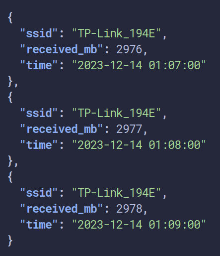

# wifi-api
Rest api for get wifi statistic



On build choise storage inmemory, sqlite or boltdb.
Example
```bash
go build -tags=boltdb .
```

Use curl for get result
```bash
curl localhost:8080/api/2023-12-14 | jq
```
